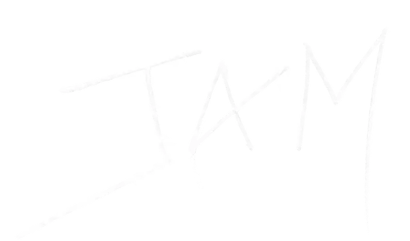

<!-- _class: invert title -->
<!-- _paginate: false -->


# Rust in Protocols and Smart Contracts

<!--
Hi everyone. This talk is about Rust in blockchain, from two angles: Rust as the language protocols themselves are built in, and Rust as a language you write smart contracts in.
-->

---
## Introduction

<div style="display: flex; gap: 2em; justify-content: center; text-align: center;">
  <div>
    
    <p><strong>Luka Ciric</strong><br />Core Developer @ Parity</p>
  </div>
  <div>
    
    <p><strong>Dragan Milosevic</strong><br />Applied Engineer @ Parity</p>
  </div>
</div>

<!--
Quick intro. I'm Luka, core developer at Parity, and this is Dragan, applied engineer. We both work at Parity, building Polkadot protocol and things around it. Today we'll show you how blockchains use Rust in general, and then take a closer look at how Polkadot puts it to work.
-->

---

<h1 style="display: flex; align-items: center; gap: 0.5em;">Rust in Protocols </h1>

<!--
First part: Rust in protocols. Before we get into why, let's look at who actually runs on Rust. Two groups: chains whose original node was written in Rust, and chains where someone came back later and wrote an alternative node in Rust.
-->

---

## Original Node written in Rust
<div style="display: grid; grid-template-columns: repeat(3, 1fr); gap: 1.5em 2em; justify-items: center; text-align: center;">
  <div>
    
    <p><strong>Polkadot</strong></p>
  </div>
  <div>
    
    <p><strong>Solana</strong></p>
  </div>
  <div>
    
    <p><strong>Hyperliquid</strong></p>
  </div>
  <div>
    
    <p><strong>NEAR</strong></p>
  </div>
  <div>
    
    <p><strong>Sui</strong></p>
  </div>
  <div>
    
    <p><strong>Aptos</strong></p>
  </div>
</div>

<!--
Polkadot: built on Substrate, our Rust framework - node and runtime are Rust end to end.
Solana: the original validator (now Agave) is Rust; the 400ms slot times basically demand it.
Hyperliquid: L1 with its own HyperBFT consensus, whole node written in Rust, closed source.
NEAR: nearcore is Rust, and Rust is also its main contract language.
Sui: Mysten Labs, Rust node with Move contracts, grew out of Meta's Diem work.
Aptos: also a Diem descendant - aptos-core in Rust, contracts in Move.
-->

---
## Alternative Node written in Rust

<div style="display: grid; grid-template-columns: repeat(3, 1fr); gap: 1.5em 2em; justify-items: center; align-items: end; text-align: center;">
  <div>
    
    <p><strong>Reth</strong></p>
  </div>
  <div>
    
    <p><strong>Lighthouse</strong></p>
  </div>
  <div>
    
    <p><strong>Grandine</strong></p>
  </div>
  <div>
    
    <p><strong>Trin</strong></p>
  </div>
  <div>
    
    <p><strong>Zebra</strong></p>
  </div>
  <div>
    
    <p><strong>Floresta</strong></p>
  </div>
</div>

<!--
Reth: Ethereum execution node by Paradigm, built for speed and modularity.
Lighthouse: Ethereum consensus node by Sigma Prime, among the most-run validators.
Grandine: Ethereum consensus node focused on high performance and parallelization.
Trin: Ethereum light node for the Portal Network, by the Ethereum Foundation.
Zebra: alternative to zcashd that is now deprecated, so its becoming main node.
Floresta: lightweight Bitcoin node using utreexo, runs on tiny hardware.
-->
---

<h1 style="display: flex; align-items: center; gap: 0.5em;">Why Rust? </h1>

<!--
So that's who. Now the obvious question: why do all these teams keep landing on the same language?
-->

---
## Why Rust?

Some examples of why protocols use Rust.

<div style="display: grid; grid-template-columns: 1fr 1fr; gap: 1.2em; margin-top: 1.2em;">
  <div style="background: rgba(255,255,255,0.07); border: 1px solid rgba(255,255,255,0.18); border-radius: 12px; padding: 1.1em 1.3em;">
    <strong>Memory safety</strong>
    <p style="margin: 0.4em 0 0; opacity: 0.75;">without a garbage collector</p>
  </div>
  <div style="background: rgba(255,255,255,0.07); border: 1px solid rgba(255,255,255,0.18); border-radius: 12px; padding: 1.1em 1.3em;">
    <strong>Predictable performance</strong>
    <p style="margin: 0.4em 0 0; opacity: 0.75;">no GC pauses on the hot path</p>
  </div>
  <div style="background: rgba(255,255,255,0.07); border: 1px solid rgba(255,255,255,0.18); border-radius: 12px; padding: 1.1em 1.3em;">
    <strong>Concurrency and Parallelization</strong>
    <p style="margin: 0.4em 0 0; opacity: 0.75;">networking, DB and VM all run in parallel</p>
  </div>
  <div style="background: rgba(255,255,255,0.07); border: 1px solid rgba(255,255,255,0.18); border-radius: 12px; padding: 1.1em 1.3em;">
    <strong>Compile-time correctness</strong>
    <p style="margin: 0.4em 0 0; opacity: 0.75;">bugs in consensus cost real money</p>
  </div>
</div>

<!--
Memory safety: most critical CVEs in C/C++ systems are memory bugs. In a chain client that means an exploit or a chain halt. Rust removes the whole class without adding a GC.

Performance: validators live on hard deadlines, 400ms slots on Solana, 6s on Polkadot. A GC pause at the wrong moment means a missed block. Rust gives C-level speed with predictable latency.

Concurrency: a node is a networking stack, a database and a VM running at once. Send/Sync turn data races into compile errors. Parallel execution engines like Solana's Sealevel and Sui lean on this.

Correctness: you cannot hotfix consensus, a bad block is final and the bug is worth billions. Result instead of exceptions, exhaustive match, no null. Big bug classes never ship.
-->

---

<h1 style="display: flex; align-items: center; gap: 0.5em;">Polkadot </h1>

<!--
Now the chain we know best. Let's look at how Polkadot is built and where Rust fits into it.
-->

---
## Polkadot SDK

Our monorepo built in Rust

- **Substrate**
- **FRAME**


<!--
Polkadot SDK is our monorepo, ~3 million lines of Rust, one of the largest Rust codebases anywhere. Two parts matter for this talk: Substrate and FRAME.

The idea: don't build a chain from scratch, compose one with existing components.

Everything is Rust end to end: the node, the runtime, the tooling. The runtime compiles to WASM, which is where the next slides pick up.
-->

---
## Substrate

Rust framework for building blockchains

- **Node + Runtime** - the node runs the infrastructure, the runtime defines logic
- **Infrastructure** - libp2p networking, database, transaction pool, RPC
- **Pluggable consensus** - Aura, BABE + GRANDPA, PoW, or write your own
- **Chain-agnostic node** - the node executes whatever runtime gives it
- **Battle-tested** - Polkadot, Kusama and hundreds of parachains run on it

<!--
Substrate splits a chain in two. The node is the infrastructure every chain shares: networking, consensus, database, transaction pool, RPC. The runtime is what makes your chain yours: what transactions exist, what state looks like, what the rules are.

The node is deliberately dumb about your chain. It executes whatever runtime it is given, so the same node binary can run very different chains. Consensus sits behind an interface too: Polkadot uses BABE + GRANDPA, a solo chain can run Aura or even PoW.

You write the runtime, Substrate handles the rest. The next slide shows what that runtime code looks like.
-->

--- 

## Substrate code

<style scoped>
pre { font-size: 0.65em; }
</style>

```rust
#[frame_support::pallet]
pub mod pallet {
    use frame_support::prelude::*;

    #[pallet::config]
    pub trait Config: frame_system::Config {}

    #[pallet::storage]
    pub type Counter<T: Config> = StorageValue<_, u32, ValueQuery>;

    #[pallet::call]
    impl<T: Config> Pallet<T> {
        #[pallet::call_index(0)]
        pub fn increment(origin: OriginFor<T>) -> DispatchResult {
            ensure_signed(origin)?;
            Counter::<T>::mutate(|c| *c += 1);

            Ok(())
        }
    }
}
```

<!--
This is a complete piece of chain logic: a counter anyone can increment. Don't read every line. One attribute declares the storage, one marks the calls, ensure_signed checks who's calling. Storage is a typed value, not raw bytes. This is FRAME code, and FRAME is the next slide.
-->

---
## FRAME

The framework for writing the runtime itself

- **Pallet** - one module of chain logic: storage, calls, events, errors
- **Composable** - a runtime is a list of pallets, wired together with one macro
- **Batteries included** - balances, staking, governance, multisig, ~50 more
- **Macro-driven** - storage keys, SCALE codecs, dispatch and metadata are generated
- **Generic** - every pallet is generic over its `Config`, reusable across chains

<!--
FRAME stands for Framework for Runtime Aggregation of Modularized Entities. Substrate gives you the node, FRAME gives you the language for the runtime running inside it.

You pick pallets off the shelf, write your own for the logic that makes your chain unique, and construct_runtime! composes them into one runtime. The next slide shows what FRAME actually saves you from.
-->

---
## Without FRAME

<style scoped>
pre { font-size: 0.65em; }
</style>

```rust
const COUNTER_KEY: &[u8] = b"counter";

fn dispatch(origin: Origin, mut call: &[u8])
    -> Result<(), &'static str>
{
    let _who = match origin {
        Origin::Signed(who) => who,
        _ => return Err("call must be signed"),
    };
    match u8::decode(&mut call).map_err(|_| "bad call")? {
        0 => {
            let counter = sp_io::storage::get(COUNTER_KEY)
                .and_then(|raw| u32::decode(&mut &raw[..]).ok())
                .unwrap_or(0);
            sp_io::storage::set(COUNTER_KEY, &(counter + 1).encode());
            Ok(())
        }
        _ => Err("unknown call"),
    }
}
```

<!--
The runtime as functions over raw key-value storage: you invent storage keys and hope no other module picks the same one, you decode the call bytes yourself, you route on a call index yourself. No metadata, no events, no weights, no automatic rollback.
-->

---
## With FRAME


```rust
    #[pallet::storage]
    pub type Counter<T: Config> =
        StorageValue<_, u32, ValueQuery>;

    #[pallet::call]
    impl<T: Config> Pallet<T> {
        #[pallet::call_index(0)]
        pub fn increment(origin: OriginFor<T>)
            -> DispatchResult
        {
            ensure_signed(origin)?;
            Counter::<T>::mutate(|c| *c += 1);
            Ok(())
        }
    }
```

<!--
Same counter with FRAME: storage keys, SCALE codecs, dispatch and metadata are generated. A few attributes, and wallets can see the call exists.
-->

---

## Runtime

The chain's whole logic, compiled from Rust to **WASM** and stored on-chain

- **Executed block by block** - the node runs whatever blob is in storage
- **Forkless upgrades** - one transaction swaps the blob, next block runs the new logic
- **Replay** - anyone can replay whole blockchain with runtimes that were active at the time.

<!--
The runtime lives in chain state under the :code key. Every block, the node loads that blob and executes it - the logic of the chain is itself just data on the chain.

Upgrade = a set_code transaction, approved through governance, that replaces the blob. From the next block every node runs the new logic. No "please update your binary by Tuesday", no fork.

The blob is compressed Rust-to-WASM, capped at 5 MiB compressed for parachain code, and the upgrade transaction basically fills a whole block.
-->

---

### Runtime Configuration code

```rust
#[derive_impl(frame_system::config_preludes::SolochainDefaultConfig)]
impl frame_system::Config for Runtime {
    type Block = Block;
    type AccountId = AccountId;
}

impl pallet_counter::Config for Runtime {}

construct_runtime!(
    pub enum Runtime {
        System: frame_system,
        Balances: pallet_balances,
        Timestamp: pallet_timestamp,
        Counter: pallet_counter,
    }
);
```

<!--
This is the whole wiring: each pallet gets an impl of its Config trait on the Runtime type, and construct_runtime! composes the list into one runtime. The Counter pallet from earlier plugs in with one empty impl.

derive_impl fills frame_system's ~30 associated types with sane defaults, you override only what differs. All of this resolves at compile time - the composed runtime is one static type, no dynamic dispatch anywhere.
-->

---

## Node

Everything around the runtime, one Rust binary running dozens of tasks at once

- **Networking** - libp2p: peer discovery, block sync, gossip, parachain traffic
- **Database** - Merkle trie state on top of RocksDB / ParityDB
- **WASM executor** - loads and runs the runtime blob
- **Hard deadlines** - 6s slots, ~2s to validate a parachain block

<!--
The node is everything the runtime is not: an async Rust binary on Tokio where networking, consensus, the database and the WASM executor all run concurrently. Dozens of tasks touching shared state - Send and Sync turn every data race into a compile error. In C++ the same architecture is a production heisenbug generator.

Why only Rust. It needs four things at once: C-level speed, predictable latency, memory safety, and WASM as a first-class target.
- C/C++ has the speed but parses untrusted bytes from the open internet on machines that hold keys - one memory bug is a remote exploit.
- Go or Java are safe but GC pauses land in the 2s parachain validation window, and a validator that misses deadlines misses blocks.
- And the trick nothing else offers: the node and the runtime share the same crates and SCALE codec, because the same no_std Rust compiles to native for the node and to WASM for the runtime. One language end to end, no spec drift between the two halves.
-->

---


## Benchmarking & Weights

- **Weight** - worst-case execution time + storage I/O of a call, measured on reference hardware
- **`#[benchmarks]`** - a benchmark per call, run against worst-case inputs
- **Fees** - weight is known before execution, so the fee is too
- **Block limits** - blocks fill up by weight, execution never blows the slot
- **Refunds** - a call that used less than its worst case refunds the difference

<!--
There is no gas metering at runtime. Instead every call is benchmarked ahead of time on reference hardware, against worst-case inputs, and the result is the weight baked into the runtime.

Because the weight is known before execution, the transaction pool can price and fill blocks without running anything. If the call turns out cheaper than the worst case, the difference is refunded post-dispatch.
-->

---

<h1 style="display: flex; align-items: center; gap: 0.6em;">Rust in Polkadot
  <span style="position: relative; display: inline-block;">
    
    
  </span>
</h1>

<!--
You've seen the architecture. Now let's zoom in on the language itself: the Rust features that make this design work, and what we get out of each one.
-->

---

## Macros

- **`#[pallet::*]`** - storage, calls, events, errors and metadata from a few attributes
- **`construct_runtime!`** - composes pallets into a runtime with one macro call
- **`#[derive(Encode, Decode, TypeInfo)]`** - SCALE codec and metadata for every type
- **`#[benchmarks]`** - benchmark suites that produce the weight of every call
- **The payoff** - the mechanical 90% is generated, reviewed once, reused everywhere

<!--
Everything on the left of the Without FRAME slide is what these macros generate.
-->

---

## Generics

```rust
#[pallet::config]
pub trait Config: frame_system::Config {
    type RuntimeEvent: From<Event<Self>>;
    type Currency: Currency<Self::AccountId>;
    type MaxProposals: Get<u32>;
}
```

- **`Config` trait** - a pallet declares what it needs, the runtime supplies it
- **Loose coupling** - pallets depend on traits like `Currency`, never on each other
- **Compile-time wiring** - monomorphization, no dynamic dispatch, zero runtime cost
- **Reuse** - the same pallet code runs on hundreds of different chains

<!--
AccountId, balances, block numbers are all associated types. Kusama and Polkadot run the same pallets with different Config impls.
-->

---

## Predictable execution

- **Deterministic by construction** - no floats, no clocks, no randomness, no threads
- **Weights** - every call benchmarked, worst-case cost known before execution
- **Runtime as a library** - blocks execute in plain unit tests, no node needed
- **XCM simulator** - relay + parachains in memory, cross-chain messages in a test
- **try-runtime** - replay real chain state against new code before it ships

<!--
Determinism is consensus: one node computing a different state root is a fork. Pure Rust makes the whole runtime testable as a normal crate.
-->

---

## WASM execution

- **Wasmtime** - the node compiles and runs whatever blob is in state
- **Sandboxed** - WASM is the trust boundary between node and runtime
- **Host functions** - storage, crypto and hashing provided by the node
- **Why it matters** - logic as an on-chain blob is what makes forkless upgrades possible

<!--
One codebase, two compilation targets, no spec drift. Compiled runtimes are cached, so the JIT cost is paid once per upgrade.
-->

---

# What is next for Polkadot?

<!--
So far you've seen how Polkadot works today. I'm going to show you what's coming next. Two things: a new virtual machine, and JAM. And then a different angle — Rust as a smart contract language.
-->

---
## PVM & PolkaVM

RISC-V based, written in Rust

- **PVM vs PolkaVM** - PVM is the spec (Gray Paper), PolkaVM is Parity's implementation
- **RISC-V** - a real ISA instead of a custom bytecode, LLVM does the heavy lifting
- **Register-based** - maps straight onto real CPUs
- **Fast** - O(n) recompilation, targets near-native execution
- **Sandboxed** - per-instance process isolation, deterministic, cheap gas metering
- **Metered** - instead of having weights before execution spending is measured on-go

<!--
First, some terminology, because these two names get mixed up constantly. PVM is the specification. It's the document that says which instructions exist and what they do. PolkaVM is our implementation of that spec, written in Rust.

It's built on RISC-V. That's a real, open instruction set — the same one you find in actual hardware. Why does that help? Because anything that compiles through LLVM can compile to RISC-V. Rust, C, C++, and Solidity. We don't have to build our own compiler — LLVM does the heavy lifting.

The second nice thing is that RISC-V is register-based, just like real processors. Instructions map almost directly onto what a CPU already understands, so translating to native code is straightforward. That's where comes from.

Sandboxed — every program runs in isolation, deterministically, and metering is cheap.

And the last point, which is the difference from the weights you heard about earlier. With weights, the cost is measured up front. Here, spending is measured as you go, while the code runs.
-->

---


<!--
This is the second big piece. JAM — the Join-Accumulate Machine.
-->

---

### What is JAM

- **Generalizes Polkadot** - services replace hardcoded parachains, breaking the silos
- **Refine** - stateless, massively parallel computation on cores
- **Accumulate** - folds refinement outputs into chain state
- **OnTransfer** - handles messages between services
- **D3 Lake** - distributed data lake, ~850 MB/s of shared data availability
- **Runs on PVM** - the RISC-V VM is the execution layer

<!--
JAM generalizes Polkadot.

Today, parachains are baked into the protocol itself — Polkadot knows what a parachain is. In JAM, that's gone. Instead you have services, and a parachain becomes just one service among many. That's the "breaking the silos" part on the slide.

A service is three functions, and those are the next three bullets.

Refine is computation. It runs on cores, it doesn't touch state, and because of that it can run massively in parallel.

Accumulate takes those results and folds them into the chain state.

OnTransfer is communication — messages between services.

Then there's the D3 Lake. Today every parachain keeps its data separately, and crossing that boundary means sending an XCM message. The D3 Lake is a shared space for data, spread across the validators. Around 850 megabytes per second — roughly 42 times what Polkadot does today. One service drops a result in, another picks it up. No more walls.

And finally — all of this runs on PVM. So the machine from the previous slide is the execution layer for JAM.
-->

---

## JAM Competition

<div style="font-size: 0.48em; margin-top: 0.8em;">
  <div style="display: flex; align-items: center; margin-bottom: 0.35em;">
    <div style="width: 280px; text-align: right; padding-right: 1em;"><span style="opacity: 0.4;">1</span> <strong>PolkaJam recompiler</strong> <span style="opacity: 0.6;">Rust</span></div>
    <div style="flex: 1; display: flex; align-items: center;"><div style="width: 2.3%; height: 11px; background: #dea584; border-radius: 4px;"></div><span style="padding-left: 0.6em; white-space: nowrap;">1.8 ms</span></div>
  </div>
  <div style="display: flex; align-items: center; margin-bottom: 0.35em;">
    <div style="width: 280px; text-align: right; padding-right: 1em;"><span style="opacity: 0.4;">2</span> <strong>SpaceJam</strong> <span style="opacity: 0.6;">Rust</span></div>
    <div style="flex: 1; display: flex; align-items: center;"><div style="width: 2.9%; height: 11px; background: #dea584; border-radius: 4px;"></div><span style="padding-left: 0.6em; white-space: nowrap;">2.3 ms</span></div>
  </div>
  <div style="display: flex; align-items: center; margin-bottom: 0.35em;">
    <div style="width: 280px; text-align: right; padding-right: 1em;"><span style="opacity: 0.4;">3</span> <strong>PolkaJam</strong> <span style="opacity: 0.6;">Rust</span></div>
    <div style="flex: 1; display: flex; align-items: center;"><div style="width: 3.4%; height: 11px; background: #dea584; border-radius: 4px;"></div><span style="padding-left: 0.6em; white-space: nowrap;">2.7 ms</span></div>
  </div>
  <div style="display: flex; align-items: center; margin-bottom: 0.35em;">
    <div style="width: 280px; text-align: right; padding-right: 1em;"><span style="opacity: 0.4;">4</span> <strong>JAM DUNA</strong> <span style="opacity: 0.6;">Go</span></div>
    <div style="flex: 1; display: flex; align-items: center;"><div style="width: 7.2%; height: 11px; background: #00add8; border-radius: 4px;"></div><span style="padding-left: 0.6em; white-space: nowrap;">5.9 ms</span></div>
  </div>
  <div style="display: flex; align-items: center; margin-bottom: 0.35em;">
    <div style="width: 280px; text-align: right; padding-right: 1em;"><span style="opacity: 0.4;">5</span> <strong>Jamzilla</strong> <span style="opacity: 0.6;">Go</span></div>
    <div style="flex: 1; display: flex; align-items: center;"><div style="width: 7.3%; height: 11px; background: #00add8; border-radius: 4px;"></div><span style="padding-left: 0.6em; white-space: nowrap;">5.9 ms</span></div>
  </div>
  <div style="display: flex; align-items: center; margin-bottom: 0.35em;">
    <div style="width: 280px; text-align: right; padding-right: 1em;"><span style="opacity: 0.4;">6</span> <strong>Vinwolf</strong> <span style="opacity: 0.6;">Rust</span></div>
    <div style="flex: 1; display: flex; align-items: center;"><div style="width: 7.4%; height: 11px; background: #dea584; border-radius: 4px;"></div><span style="padding-left: 0.6em; white-space: nowrap;">6.0 ms</span></div>
  </div>
  <div style="display: flex; align-items: center; margin-bottom: 0.35em;">
    <div style="width: 280px; text-align: right; padding-right: 1em;"><span style="opacity: 0.4;">7</span> <strong>FastRoll</strong> <span style="opacity: 0.6;">Rust</span></div>
    <div style="flex: 1; display: flex; align-items: center;"><div style="width: 8.7%; height: 11px; background: #dea584; border-radius: 4px;"></div><span style="padding-left: 0.6em; white-space: nowrap;">7.0 ms</span></div>
  </div>
  <div style="display: flex; align-items: center; margin-bottom: 0.35em;">
    <div style="width: 280px; text-align: right; padding-right: 1em;"><span style="opacity: 0.4;">8</span> <strong>Strawberry</strong> <span style="opacity: 0.6;">Go</span></div>
    <div style="flex: 1; display: flex; align-items: center;"><div style="width: 10.3%; height: 11px; background: #00add8; border-radius: 4px;"></div><span style="padding-left: 0.6em; white-space: nowrap;">8.4 ms</span></div>
  </div>
  <div style="display: flex; align-items: center; margin-bottom: 0.35em;">
    <div style="width: 280px; text-align: right; padding-right: 1em;"><span style="opacity: 0.4;">9</span> <strong>JamZig</strong> <span style="opacity: 0.6;">Zig</span></div>
    <div style="flex: 1; display: flex; align-items: center;"><div style="width: 12.5%; height: 11px; background: #ec915c; border-radius: 4px;"></div><span style="padding-left: 0.6em; white-space: nowrap;">10.1 ms</span></div>
  </div>
  <div style="display: flex; align-items: center; margin-bottom: 0.35em;">
    <div style="width: 280px; text-align: right; padding-right: 1em;"><span style="opacity: 0.4;">10</span> <strong>Jamixir</strong> <span style="opacity: 0.6;">Elixir</span></div>
    <div style="flex: 1; display: flex; align-items: center;"><div style="width: 15.3%; height: 11px; background: #6e4a7e; border-radius: 4px;"></div><span style="padding-left: 0.6em; white-space: nowrap;">12.4 ms</span></div>
  </div>
  <p style="opacity: 0.5; margin: 0.6em 0 0.35em; text-align: right;">fastest client per remaining language</p>
  <div style="display: flex; align-items: center; margin-bottom: 0.35em;">
    <div style="width: 280px; text-align: right; padding-right: 1em;"><strong>JavaJAM</strong> <span style="opacity: 0.6;">Java</span></div>
    <div style="flex: 1; display: flex; align-items: center;"><div style="width: 16.4%; height: 11px; background: #b07219; border-radius: 4px;"></div><span style="padding-left: 0.6em; white-space: nowrap;">13.3 ms</span></div>
  </div>
  <div style="display: flex; align-items: center; margin-bottom: 0.35em;">
    <div style="width: 280px; text-align: right; padding-right: 1em;"><strong>Boka</strong> <span style="opacity: 0.6;">Swift</span></div>
    <div style="flex: 1; display: flex; align-items: center;"><div style="width: 29.5%; height: 11px; background: #ffac45; border-radius: 4px;"></div><span style="padding-left: 0.6em; white-space: nowrap;">23.9 ms</span></div>
  </div>
  <div style="display: flex; align-items: center; margin-bottom: 0.35em;">
    <div style="width: 280px; text-align: right; padding-right: 1em;"><strong>TSJam</strong> <span style="opacity: 0.6;">TypeScript</span></div>
    <div style="flex: 1; display: flex; align-items: center;"><div style="width: 36%; height: 11px; background: #3178c6; border-radius: 4px;"></div><span style="padding-left: 0.6em; white-space: nowrap;">29.2 ms</span></div>
  </div>
  <div style="display: flex; align-items: center; margin-bottom: 0.35em;">
    <div style="width: 280px; text-align: right; padding-right: 1em;"><strong>PyJAMaz</strong> <span style="opacity: 0.6;">Python</span></div>
    <div style="flex: 1; display: flex; align-items: center;"><div style="width: 45.3%; height: 11px; background: #3572a5; border-radius: 4px;"></div><span style="padding-left: 0.6em; white-space: nowrap;">36.7 ms</span></div>
  </div>
  <div style="display: flex; align-items: center;">
    <div style="width: 280px; text-align: right; padding-right: 1em;"><strong>JAM Forge</strong> <span style="opacity: 0.6;">Scala</span></div>
    <div style="flex: 1; display: flex; align-items: center;"><div style="width: 88%; height: 11px; background: #c22d40; border-radius: 4px;"></div><span style="padding-left: 0.6em; white-space: nowrap;">71.4 ms</span></div>
  </div>
  <p style="opacity: 0.5; margin-top: 0.6em; text-align: right;">weighted step time over W3F test vector traces - JAM conformance dashboard, May 2026</p>
</div>

<!--
Now something concrete. These numbers come from our conformance dashboard. Several teams are writing their own JAM implementation, they all run the same test vectors, so this is a fair comparison.

The top ten is up here. Below the line is the fastest client from each language that didn't make the top ten.

The story is pretty clear. The top three are all Rust. Five of the top ten are Rust. The fastest one does a step in under two milliseconds. Go fills most of the rest.

And below the line — the best entry from every remaining language isthan the entire top ten. Java, Swift, Python, and Scala at the bottom. Scala is about forty times slower than the leader.

The point isn't that only Rust can be fast. The point is that the teams writing in Rust consistently end up at the top of this table.
-->

---

<h1 style="display: flex; align-items: center; gap: 0.5em;">Rust in Smart Contracts </h1>

<!--
So far we've talked about the protocol — the node, the virtual machine. Now the other angle: Rust as a language for writing smart contracts.
-->

---

## Rust as a smart contract language

<div style="display: grid; grid-template-columns: repeat(3, 1fr); gap: 1.2em 2em; justify-items: center; align-items: end; text-align: center;">
  <div>
    
    <p><strong>Rust SC</strong><br /><span style="opacity: 0.6;">Polkadot</span></p>
  </div>
  <div>
    
    <p><strong>Anchor</strong><br /><span style="opacity: 0.6;">Solana</span></p>
  </div>
  <div>
    
    <p><strong>Pinocchio</strong><br /><span style="opacity: 0.6;">Solana</span></p>
  </div>
  <div>
    
    <p><strong>near-sdk-rs</strong><br /><span style="opacity: 0.6;">NEAR</span></p>
  </div>
  <div>
    
    <p><strong>CosmWasm</strong><br /><span style="opacity: 0.6;">Cosmos ecosystem</span></p>
  </div>
  <div>
    
    <p><strong>multiversx-sc</strong><br /><span style="opacity: 0.6;">MultiversX</span></p>
  </div>
</div>

<p style="opacity: 0.5; text-align: center; font-size: 0.7em; margin-top: 0.5em;">Also: Soroban (Stellar), Internet Computer, Casper</p>

<!--
Rust isn't a contract language only on Polkadot. This is already a broad ecosystem.

Rust SC is Polkadot — that's what the next two slides are about.

Anchor is the main framework on Solana; its macros generate most of the boilerplate for you. Pinocchio is the lighter alternative on Solana, for when you want the smallest and cheapest contract possible.

On NEAR, Rust is the primary contract language. CosmWasm is the contract layer for a large part of the Cosmos ecosystem — Osmosis, Injective, and plenty of other chainrsX is Rust-first as well.

And there's more at the bottom — Soroban on Stellar is Rust-only, and so are Internet Computer and Casper.

So if you write contracts in Rust, that knowledge carries across chains.
-->

---

## Smart contracts on PVM

Solidity and Rust

- **pallet_revive** - the FRAME pallet that deploys and executes PolkaVM contracts
- **revive / resolc** - recompiles Solidity via YUL and LLVM to RISC-V
- **Ethereum tooling works** - Hardhat, Foundry, Remix, MetaMask over an ETH RPC layer
- **Rust contracts** - `cargo pvm-contract`: scaffold, build, get `.polkavm` + ABI
- **Dual VM stack** - Polkadot Hub runs REVM and PolkaVM side by side

<!--
Solidity and Rust, on the same machine.

pallet_revive is the runtime module that deploys and executes contracts. It's the entry point for everything else on this slide.

revive, or resolc, is the compiler for Solidity. It takes ordinary Solidity code and compiles it to RISC-V instead of EVM bytecode. An existing contract recompiles as-is.

And that's why Ethereum tooling works — Hardhat, Foundry, Remix, MetaMask. There's an RPC layer that behaves like an Ethereum node, so the tools don't notice the difference.

Rust contracts go through cargo pvm-contract. It scaffolds the project, builds it, and gives you the contract and the ABI.

And finally, the dual VM stack. Polkadot Hub runs two machines side by side. REVM executes standard Ethereum bytecode directlat's where you bring your contract over with no changes, and it's the starting point for most people. PolkaVM is there when you need the performance. Same chain either way; you pick per project.
-->

---

## Rust vs Solidity on PVM

<div style="display: grid; grid-template-columns: 1fr 1fr; gap: 1.25em; align-items: start; font-size: 0.7em;">

<div>

**Solidity** (revive / resolc)

```cpp
contract Counter {
    uint256 private count;

    function increment() public {
        count += 1;
    }

    function getCount() public view returns (uint256) {
        return count;
    }
}
```
</div>

<div>

**Rust** (cargo pvm-contract)

```rust
#[pvm::storage]
struct Storage {
    count: u64,
}

#[pvm::contract]
mod counter {
    use super::*;

    #[pvm::method]
    pub fn increment() {
        let c = Storage::count().get().unwrap_or(0);
        Storage::count().set(&(c + 1));
    }

    #[pvm::method]
    pub fn count() -> u64 {
        Storage::count().get().unwrap_or(0)
    }
}
```

</div>

</div>

<!--
And here's the concrete comparison. The same contract — a simple counter — in both languages.

On the left, Solidity. This is what anyone who's written for Ethereum already knows. Nothing new here, and that's the point.

On the right, the same contract in Rust. The structure is always the same: one attribute describes what the contract stores, another marks the module as a contract, and a third marks the methods callable from outside. The macros generate everything else — entry points, call routing, encoding.

The important part is that this is compatible with Solidity at the ABI and storage level. In practice that means Ethereum libraries work unchanged, and a Solidity contract and a Rust contract can call each other directly.

Rust is more verbose on a tiny example s. But you get the whole Cargo ecosystem, real testing, and types that hold up once the contract grows.

And that's the whole story in one line: the same language from the node, through the runtime, all the way to the contract.
-->

---


---

