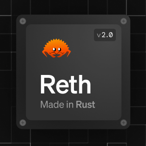

# Rust in Protocols and Smart Contracts

---
# Introduction

<div style="display: flex; gap: 2em; justify-content: center; text-align: center;">
  <div>
    
    <p><strong>Luka Ciric</strong><br />Core Developer @ Parity</p>
  </div>
  <div>
    
    <p><strong>Dragan Milosevic</strong><br />Applied Engineer @ Parity</p>
  </div>
</div>

---
# Which protocols use Rust
---
## Complete protocol in Rust
<div style="display: grid; grid-template-columns: repeat(3, 1fr); gap: 1.5em 2em; justify-items: center; text-align: center;">
  <div>
    
    <p><strong>Polkadot</strong></p>
  </div>
  <div>
    
    <p><strong>Solana</strong></p>
  </div>
  <div>
    
    <p><strong>Hyperliquid</strong></p>
  </div>
  <div>
    
    <p><strong>NEAR</strong></p>
  </div>
  <div>
    
    <p><strong>Sui</strong></p>
  </div>
  <div>
    
    <p><strong>Oasis</strong></p>
  </div>
</div>

---
## Clients written in Rust

<div style="display: grid; grid-template-columns: repeat(3, 1fr); gap: 1.5em 2em; justify-items: center; align-items: end; text-align: center;">
  <div>
    
    <p><strong>Reth</strong></p>
  </div>
  <div>
    
    <p><strong>Lighthouse</strong></p>
  </div>
  <div>
    
    <p><strong>Grandine</strong></p>
  </div>
  <div>
    
    <p><strong>Trin</strong></p>
  </div>
  <div>
    
    <p><strong>Zebra</strong></p>
  </div>
  <div>
    
    <p><strong>Floresta</strong></p>
  </div>
</div>

<!--
Reth is an execution client, Lighthouse and Grandine are consensus clients, Trin is a light client - all Ethereum.
Zebra is a Zcash alt client, Floresta is a Bitcoin alt client.
-->
---
# Why they use it
---
## Examples
--

- **Memory safety without a garbage collector**
- **Predictable performance** - no GC pauses on the hot path
- **Fearless concurrency** - networking, DB and VM all run in parallel
- **Compile-time correctness** - bugs in consensus cost real money

<!--
Memory safety: most critical CVEs in C/C++ systems are memory bugs. In a chain client that means an exploit or a chain halt. Rust removes the whole class without adding a GC.

Performance: validators live on hard deadlines, 400ms slots on Solana, 6s on Polkadot. A GC pause at the wrong moment means a missed block. Rust gives C-level speed with predictable latency.

Concurrency: a node is a networking stack, a database and a VM running at once. Send/Sync turn data races into compile errors. Parallel execution engines like Solana's Sealevel and Sui lean on this.

Correctness: you cannot hotfix consensus, a bad block is final and the bug is worth billions. Result instead of exceptions, exhaustive match, no null. Big bug classes never ship.
-->

---

# Polkadot

---
## Polkadot-SDK

Our Rust monorepo that is built in Rust

- **Substrate** - the framework: networking, consensus, database, RPC
- **FRAME** - composable runtime modules (pallets) for building chain logic

<!--
Polkadot SDK is our monorepo, ~3 million lines of Rust, one of the largest Rust codebases anywhere. Two parts matter for this talk: Substrate and FRAME.

The idea: don't build a chain from scratch, compose one. Substrate gives you the node infrastructure for free, FRAME gives you building blocks like balances, staking, governance - you write only the logic that makes your chain different.

Everything is Rust end to end: the node, the runtime, the tooling. The runtime compiles to WASM, which is where the next slides pick up.
-->

---
## Substrate

The framework that gives you a working blockchain out of the box

- **Node + runtime split** - the node runs the infrastructure, the runtime is your chain's logic
- **Infrastructure for free** - libp2p networking, database, transaction pool, RPC
- **Pluggable consensus** - Aura, BABE + GRANDPA, PoW, or write your own
- **Chain-agnostic node** - the node just executes whatever runtime you give it
- **Battle-tested** - Polkadot, Kusama and hundreds of parachains run on it

<!--
Substrate splits a chain in two. The node is the infrastructure every chain shares: networking, consensus, database, transaction pool, RPC. The runtime is what makes your chain yours: what transactions exist, what state looks like, what the rules are.

The node is deliberately dumb about your chain. It executes whatever runtime it is given, so the same node binary can run very different chains. Consensus sits behind an interface too: Polkadot uses BABE + GRANDPA, a solo chain can run Aura or even PoW.

You write the runtime, Substrate handles the rest. The next slide shows what that runtime code looks like.
-->

--- 

## Example of Substrate code

```rust
#[frame_support::pallet]
pub mod pallet {
    use frame_support::prelude::*;

    #[pallet::config]
    pub trait Config: frame_system::Config {}

    #[pallet::storage]
    pub type Counter<T: Config> = StorageValue<_, u32, ValueQuery>;

    #[pallet::call]
    impl<T: Config> Pallet<T> {
        #[pallet::call_index(0)]
        pub fn increment(origin: OriginFor<T>) -> DispatchResult {
            ensure_signed(origin)?;
            Counter::<T>::mutate(|c| *c += 1);

            Ok(())
        }
    }
}
```

---
## FRAME

The framework for writing the runtime itself

- **Pallet** - one module of chain logic: storage, calls, events, errors
- **Composable** - a runtime is a list of pallets, wired together with one macro
- **Batteries included** - balances, staking, governance, multisig, ~50 more
- **Macro-driven** - storage keys, SCALE codecs, dispatch and metadata are generated
- **Generic** - every pallet is generic over its `Config`, reusable across chains

<!--
FRAME stands for Framework for Runtime Aggregation of Modularized Entities. Substrate gives you the node, FRAME gives you the language for the runtime running inside it.

You pick pallets off the shelf, write your own for the logic that makes your chain unique, and construct_runtime! composes them into one runtime. The next slide shows what FRAME actually saves you from.
-->

---
## Without FRAME vs with FRAME

<div style="display: grid; grid-template-columns: 1fr 1fr; gap: 1.25em; align-items: start; font-size: 0.72em;">

<div>

**Without**

```rust
const COUNTER_KEY: &[u8] = b"counter";

fn dispatch(origin: Origin, mut call: &[u8])
    -> Result<(), &'static str>
{
    let _who = match origin {
        Origin::Signed(who) => who,
        _ => return Err("call must be signed"),
    };
    match u8::decode(&mut call).map_err(|_| "bad call")? {
        0 => {
            let counter = sp_io::storage::get(COUNTER_KEY)
                .and_then(|raw| u32::decode(&mut &raw[..]).ok())
                .unwrap_or(0);
            sp_io::storage::set(COUNTER_KEY, &(counter + 1).encode());
            Ok(())
        }
        _ => Err("unknown call"),
    }
}
```

</div>

<div>

**With FRAME**

```rust
    #[pallet::storage]
    pub type Counter<T: Config> =
        StorageValue<_, u32, ValueQuery>;

    #[pallet::call]
    impl<T: Config> Pallet<T> {
        #[pallet::call_index(0)]
        pub fn increment(origin: OriginFor<T>)
            -> DispatchResult
        {
            ensure_signed(origin)?;
            Counter::<T>::mutate(|c| *c += 1);
            Ok(())
        }
    }
```

</div>

</div>

<!--
Same counter, two ways. Left is the runtime as functions over raw key-value storage: you invent storage keys and hope no other module picks the same one, you decode the call bytes yourself, you route on a call index yourself. No metadata, no events, no weights, no automatic rollback.

Right is FRAME: storage keys, SCALE codecs, dispatch and metadata are generated. A few attributes, and wallets can see the call exists.
-->

---

## Runtime

The chain's whole logic, compiled from Rust to WASM and stored on-chain

- **Executed block by block** - the node runs whatever blob is in storage
- **Forkless upgrades** - one transaction swaps the blob, next block runs the new logic
- **No coordination** - no node updates, no repo pulls, no hard fork
- **Replay** - anyone can replay whole blockchain with runtimes that were active at the time.
- **The cost** - `no_std` only, the std library is off limits

<!--
The runtime lives in chain state under the :code key. Every block, the node loads that blob and executes it - the logic of the chain is itself just data on the chain.

Upgrade = a set_code transaction, approved through governance, that replaces the blob. From the next block every node runs the new logic. No "please update your binary by Tuesday", no fork.

The blob is compressed Rust-to-WASM, capped at 5 MiB compressed for parachain code, and the upgrade transaction basically fills a whole block.

Trade-off: there is no OS under that WASM, so the runtime is no_std Rust - no filesystem, no network, no threads, no std.
-->

---

### Example of runtime configuration

```rust
#[derive_impl(frame_system::config_preludes::SolochainDefaultConfig)]
impl frame_system::Config for Runtime {
    type Block = Block;
    type AccountId = AccountId;
}

impl pallet_counter::Config for Runtime {}

construct_runtime!(
    pub enum Runtime {
        System: frame_system,
        Balances: pallet_balances,
        Timestamp: pallet_timestamp,
        Counter: pallet_counter,
    }
);
```

<!--
This is the whole wiring: each pallet gets an impl of its Config trait on the Runtime type, and construct_runtime! composes the list into one runtime. The Counter pallet from earlier plugs in with one empty impl.

derive_impl fills frame_system's ~30 associated types with sane defaults, you override only what differs. All of this resolves at compile time - the composed runtime is one static type, no dynamic dispatch anywhere.
-->

---

## Node

Everything around the runtime, one Rust binary running dozens of tasks at once

- **Networking** - libp2p: peer discovery, block sync, gossip, parachain traffic
- **Consensus** - BABE block production and GRANDPA finality as parallel tasks
- **Database** - Merkle trie state on top of RocksDB / ParityDB
- **WASM executor** - loads and runs the runtime blob
- **Hard deadlines** - 6s slots, ~2s to validate a parachain block

<!--
The node is everything the runtime is not: an async Rust binary on Tokio where networking, consensus, the database and the WASM executor all run concurrently. Dozens of tasks touching shared state - Send and Sync turn every data race into a compile error. In C++ the same architecture is a production heisenbug generator.

Why only Rust. It needs four things at once: C-level speed, predictable latency, memory safety, and WASM as a first-class target.
- C/C++ has the speed but parses untrusted bytes from the open internet on machines that hold keys - one memory bug is a remote exploit.
- Go or Java are safe but GC pauses land in the 2s parachain validation window, and a validator that misses deadlines misses blocks.
- And the trick nothing else offers: the node and the runtime share the same crates and SCALE codec, because the same no_std Rust compiles to native for the node and to WASM for the runtime. One language end to end, no spec drift between the two halves.
-->

---

# Rust in Polkadot

---

## Macros

You write the logic, macros write the protocol

- **`#[pallet::*]`** - storage, calls, events, errors and metadata from a few attributes
- **`construct_runtime!`** - composes pallets into a runtime with one macro call
- **`#[derive(Encode, Decode, TypeInfo)]`** - SCALE codec and metadata for every type
- **`#[benchmarks]`** - benchmark suites that produce the weight of every call
- **The payoff** - the mechanical 90% is generated, reviewed once, reused everywhere

<!--
Everything on the left of the Without FRAME slide is what these macros generate.
-->

---

## Generics

One pallet, any chain: configuration through traits

```rust
#[pallet::config]
pub trait Config: frame_system::Config {
    type RuntimeEvent: From<Event<Self>>;
    type Currency: Currency<Self::AccountId>;
    type MaxProposals: Get<u32>;
}
```

- **`Config` trait** - a pallet declares what it needs, the runtime supplies it
- **Loose coupling** - pallets depend on traits like `Currency`, never on each other
- **Compile-time wiring** - monomorphization, no dynamic dispatch, zero runtime cost
- **Reuse** - the same pallet code runs on hundreds of different chains

<!--
AccountId, balances, block numbers are all associated types. Kusama and Polkadot run the same pallets with different Config impls.
-->

---

## Predictable execution

The runtime is a pure function: same input, same output, on every node

- **Deterministic by construction** - no floats, no clocks, no randomness, no threads
- **Weights** - every call benchmarked, worst-case cost known before execution
- **Runtime as a library** - blocks execute in plain unit tests, no node needed
- **XCM simulator** - relay + parachains in memory, cross-chain messages in a test
- **try-runtime** - replay real chain state against new code before it ships

<!--
Determinism is consensus: one node computing a different state root is a fork. Pure Rust makes the whole runtime testable as a normal crate.
-->

---

## WASM execution

The same Rust, two targets: native for the node, WASM for the chain

- **`wasm32-unknown-unknown`** - the runtime builds as a `no_std` WASM blob
- **Wasmtime** - the node compiles and runs whatever blob is in state
- **Sandboxed** - WASM is the trust boundary between node and runtime
- **Host functions** - storage, crypto and hashing provided by the node
- **Why it matters** - logic as an on-chain blob is what makes forkless upgrades possible

<!--
One codebase, two compilation targets, no spec drift. Compiled runtimes are cached, so the JIT cost is paid once per upgrade.
-->

---

# What is next for Polkadot?

---
## PolkaVM

Our new virtual machine: RISC-V based, written in Rust

- **PVM vs PolkaVM** - PVM is the spec (Gray Paper), PolkaVM is Parity's implementation
- **RISC-V** - a real ISA instead of a custom bytecode, LLVM does the heavy lifting
- **Register-based** - maps straight onto real CPUs, unlike the EVM's stack machine
- **Fast** - single-pass O(n) recompiler, near-native execution
- **Sandboxed** - own process per instance, deterministic, cheap gas metering

<!--
PVM is the standard: which instructions exist and what their semantics are, specified in the JAM Gray Paper. PolkaVM is our Rust implementation of it, mostly written by one engineer, Jan Bujak. That's the Rust productivity story in one line.

Why RISC-V: it's a real, open ISA. Anything with an LLVM backend compiles to it - Rust, C, C++, and Solidity through revive. The EVM is a custom stack machine no mainstream compiler targets; RISC-V registers map straight onto x86-64 and arm64 registers, so translation to native code is nearly mechanical.

Fast in two senses. Compilation is single-pass and O(n), so loading a program is near-instant and there are no JIT bombs. Execution is competitive with the best WASM VMs. And the sandbox is a separate process with roughly 128 KB overhead per instance, so isolation doesn't cost the usual gigabytes of address space.

Deterministic execution plus cheap, accurate gas metering - exactly the properties consensus needs from a VM.
-->


---
## JAM - Join-Accumulate Machine

Polkadot's next protocol: one spec, dozens of clients racing to implement it

- **Gray Paper** - Gavin Wood's spec for replacing the relay chain protocol
- **Services** - refine runs on cores in parallel, accumulate folds results into state
- **Runs on PVM** - the RISC-V VM from the previous slides
- **43 teams** - clients in Rust, C++, Zig, Go, Java, TypeScript, Swift, Python...
- **Rust is winning** - PolkaJam is the fastest client in the benchmarks

<!--
JAM = Join-Accumulate Machine. It generalizes Polkadot: instead of parachains hardcoded into the protocol, you get services. A service is three functions: refine runs on cores - stateless, massively parallel; accumulate takes the results and folds them into chain state; onTransfer handles service-to-service messages. Parachains become just one service among many. The whole thing runs on PVM, so everything from the PolkaVM slides carries over.

Deliberately multi-client: the JAM Implementers Prize, 10M DOT + 100k KSM, pushed 43 teams to build clients across five language categories, ~15 had submitted Milestone 1 conformance by early 2026. Milestones go from importer, to authorer, to full-speed audited client.

The performance story: PolkaJam, Parity's Rust client, is the fastest in published benchmarks - its recompiler runs about 2.6x faster than baseline. TurboJam (C++) and JamZig (Zig) are the closest chasers; the GC languages are nowhere near. Be honest here: it's not that only Rust CAN be fast, it's that the fastest client is Rust, built by a tiny team, reusing the PolkaVM recompiler - the same single-pass tricks from two slides ago.

Parity also runs the JAM Toaster, a supercomputer-scale test cluster, to test full-network JAM deployments before anything goes live.
-->

---

## JAM Competition

Same spec, same tests: step time per client (lower is better)

<div style="font-size: 0.48em; margin-top: 0.8em;">
  <div style="display: flex; align-items: center; margin-bottom: 0.35em;">
    <div style="width: 280px; text-align: right; padding-right: 1em;"><span style="opacity: 0.4;">1</span> <strong>PolkaJam recompiler</strong> <span style="opacity: 0.6;">Rust</span></div>
    <div style="flex: 1; display: flex; align-items: center;"><div style="width: 2.3%; height: 11px; background: #dea584; border-radius: 4px;"></div><span style="padding-left: 0.6em; white-space: nowrap;">1.8 ms</span></div>
  </div>
  <div style="display: flex; align-items: center; margin-bottom: 0.35em;">
    <div style="width: 280px; text-align: right; padding-right: 1em;"><span style="opacity: 0.4;">2</span> <strong>SpaceJam</strong> <span style="opacity: 0.6;">Rust</span></div>
    <div style="flex: 1; display: flex; align-items: center;"><div style="width: 2.9%; height: 11px; background: #dea584; border-radius: 4px;"></div><span style="padding-left: 0.6em; white-space: nowrap;">2.3 ms</span></div>
  </div>
  <div style="display: flex; align-items: center; margin-bottom: 0.35em;">
    <div style="width: 280px; text-align: right; padding-right: 1em;"><span style="opacity: 0.4;">3</span> <strong>PolkaJam</strong> <span style="opacity: 0.6;">Rust</span></div>
    <div style="flex: 1; display: flex; align-items: center;"><div style="width: 3.4%; height: 11px; background: #dea584; border-radius: 4px;"></div><span style="padding-left: 0.6em; white-space: nowrap;">2.7 ms</span></div>
  </div>
  <div style="display: flex; align-items: center; margin-bottom: 0.35em;">
    <div style="width: 280px; text-align: right; padding-right: 1em;"><span style="opacity: 0.4;">4</span> <strong>JAM DUNA</strong> <span style="opacity: 0.6;">Go</span></div>
    <div style="flex: 1; display: flex; align-items: center;"><div style="width: 7.2%; height: 11px; background: #00add8; border-radius: 4px;"></div><span style="padding-left: 0.6em; white-space: nowrap;">5.9 ms</span></div>
  </div>
  <div style="display: flex; align-items: center; margin-bottom: 0.35em;">
    <div style="width: 280px; text-align: right; padding-right: 1em;"><span style="opacity: 0.4;">5</span> <strong>Jamzilla</strong> <span style="opacity: 0.6;">Go</span></div>
    <div style="flex: 1; display: flex; align-items: center;"><div style="width: 7.3%; height: 11px; background: #00add8; border-radius: 4px;"></div><span style="padding-left: 0.6em; white-space: nowrap;">5.9 ms</span></div>
  </div>
  <div style="display: flex; align-items: center; margin-bottom: 0.35em;">
    <div style="width: 280px; text-align: right; padding-right: 1em;"><span style="opacity: 0.4;">6</span> <strong>Vinwolf</strong> <span style="opacity: 0.6;">Rust</span></div>
    <div style="flex: 1; display: flex; align-items: center;"><div style="width: 7.4%; height: 11px; background: #dea584; border-radius: 4px;"></div><span style="padding-left: 0.6em; white-space: nowrap;">6.0 ms</span></div>
  </div>
  <div style="display: flex; align-items: center; margin-bottom: 0.35em;">
    <div style="width: 280px; text-align: right; padding-right: 1em;"><span style="opacity: 0.4;">7</span> <strong>FastRoll</strong> <span style="opacity: 0.6;">Rust</span></div>
    <div style="flex: 1; display: flex; align-items: center;"><div style="width: 8.7%; height: 11px; background: #dea584; border-radius: 4px;"></div><span style="padding-left: 0.6em; white-space: nowrap;">7.0 ms</span></div>
  </div>
  <div style="display: flex; align-items: center; margin-bottom: 0.35em;">
    <div style="width: 280px; text-align: right; padding-right: 1em;"><span style="opacity: 0.4;">8</span> <strong>Strawberry</strong> <span style="opacity: 0.6;">Go</span></div>
    <div style="flex: 1; display: flex; align-items: center;"><div style="width: 10.3%; height: 11px; background: #00add8; border-radius: 4px;"></div><span style="padding-left: 0.6em; white-space: nowrap;">8.4 ms</span></div>
  </div>
  <div style="display: flex; align-items: center; margin-bottom: 0.35em;">
    <div style="width: 280px; text-align: right; padding-right: 1em;"><span style="opacity: 0.4;">9</span> <strong>JamZig</strong> <span style="opacity: 0.6;">Zig</span></div>
    <div style="flex: 1; display: flex; align-items: center;"><div style="width: 12.5%; height: 11px; background: #ec915c; border-radius: 4px;"></div><span style="padding-left: 0.6em; white-space: nowrap;">10.1 ms</span></div>
  </div>
  <div style="display: flex; align-items: center; margin-bottom: 0.35em;">
    <div style="width: 280px; text-align: right; padding-right: 1em;"><span style="opacity: 0.4;">10</span> <strong>Jamixir</strong> <span style="opacity: 0.6;">Elixir</span></div>
    <div style="flex: 1; display: flex; align-items: center;"><div style="width: 15.3%; height: 11px; background: #6e4a7e; border-radius: 4px;"></div><span style="padding-left: 0.6em; white-space: nowrap;">12.4 ms</span></div>
  </div>
  <p style="opacity: 0.5; margin: 0.6em 0 0.35em; text-align: right;">fastest client per remaining language</p>
  <div style="display: flex; align-items: center; margin-bottom: 0.35em;">
    <div style="width: 280px; text-align: right; padding-right: 1em;"><strong>JavaJAM</strong> <span style="opacity: 0.6;">Java</span></div>
    <div style="flex: 1; display: flex; align-items: center;"><div style="width: 16.4%; height: 11px; background: #b07219; border-radius: 4px;"></div><span style="padding-left: 0.6em; white-space: nowrap;">13.3 ms</span></div>
  </div>
  <div style="display: flex; align-items: center; margin-bottom: 0.35em;">
    <div style="width: 280px; text-align: right; padding-right: 1em;"><strong>Boka</strong> <span style="opacity: 0.6;">Swift</span></div>
    <div style="flex: 1; display: flex; align-items: center;"><div style="width: 29.5%; height: 11px; background: #ffac45; border-radius: 4px;"></div><span style="padding-left: 0.6em; white-space: nowrap;">23.9 ms</span></div>
  </div>
  <div style="display: flex; align-items: center; margin-bottom: 0.35em;">
    <div style="width: 280px; text-align: right; padding-right: 1em;"><strong>TSJam</strong> <span style="opacity: 0.6;">TypeScript</span></div>
    <div style="flex: 1; display: flex; align-items: center;"><div style="width: 36%; height: 11px; background: #3178c6; border-radius: 4px;"></div><span style="padding-left: 0.6em; white-space: nowrap;">29.2 ms</span></div>
  </div>
  <div style="display: flex; align-items: center; margin-bottom: 0.35em;">
    <div style="width: 280px; text-align: right; padding-right: 1em;"><strong>PyJAMaz</strong> <span style="opacity: 0.6;">Python</span></div>
    <div style="flex: 1; display: flex; align-items: center;"><div style="width: 45.3%; height: 11px; background: #3572a5; border-radius: 4px;"></div><span style="padding-left: 0.6em; white-space: nowrap;">36.7 ms</span></div>
  </div>
  <div style="display: flex; align-items: center;">
    <div style="width: 280px; text-align: right; padding-right: 1em;"><strong>JAM Forge</strong> <span style="opacity: 0.6;">Scala</span></div>
    <div style="flex: 1; display: flex; align-items: center;"><div style="width: 88%; height: 11px; background: #c22d40; border-radius: 4px;"></div><span style="padding-left: 0.6em; white-space: nowrap;">71.4 ms</span></div>
  </div>
  <p style="opacity: 0.5; margin-top: 0.6em; text-align: right;">weighted step time over W3F test vector traces - JAM conformance dashboard, May 2026</p>
</div>

<!--
Numbers come from Parity's JAM conformance dashboard: every client replays the same public W3F test vector traces, so this is an apples-to-apples measure of execution speed. Layout: the top 10 in the dashboard's own ranking, then the fastest client from each language that didn't make the top 10 (Java, Swift, TypeScript, Python, Scala). The metric is the dashboard's headline number, a weighted blend of mean/P50/P90/P99 per step, so it's slightly different from raw median.

The story: the top three are all Rust, five of the top ten are Rust, and PolkaJam's recompiler mode does a step in under 2ms. Go fills most of the rest of the top 10; Zig and Elixir sneak in at the bottom. Below the line, every remaining language's best entry is slower than the whole top 10: Java 13ms, Swift 24ms, TypeScript 29ms, Python 37ms, Scala 71ms - about 40x off the leader. Not "only Rust can be fast", but the same tiny team reusing the PolkaVM recompiler tricks tops the chart.
-->


---
# Rust in Smart Contracts
---
## Rust as a smart contract language

<div style="display: grid; grid-template-columns: repeat(3, 1fr); gap: 1.2em 2em; justify-items: center; align-items: end; text-align: center;">
  <div>
    
    <p><strong>Rust SC</strong><br /><span style="opacity: 0.6;">Polkadot</span></p>
  </div>
  <div>
    
    <p><strong>Anchor</strong><br /><span style="opacity: 0.6;">Solana</span></p>
  </div>
  <div>
    
    <p><strong>Pinocchio</strong><br /><span style="opacity: 0.6;">Solana</span></p>
  </div>
  <div>
    
    <p><strong>near-sdk-rs</strong><br /><span style="opacity: 0.6;">NEAR</span></p>
  </div>
  <div>
    
    <p><strong>CosmWasm</strong><br /><span style="opacity: 0.6;">Cosmos ecosystem</span></p>
  </div>
  <div>
    
    <p><strong>multiversx-sc</strong><br /><span style="opacity: 0.6;">MultiversX</span></p>
  </div>
</div>

<p style="opacity: 0.5; text-align: center; font-size: 0.7em; margin-top: 0.5em;">Also: Soroban (Stellar), Internet Computer, Casper</p>

<!--
Rust SC: plain Rust contracts compiled straight to RISC-V for PolkaVM with cargo pvm-contract. The next slides go deep on this.

Anchor: the de facto Solana framework. Proc macros generate account validation, instruction dispatch and an IDL, cutting most of the raw runtime boilerplate.

Pinocchio: Anza's zero-dependency alternative. No macros, no allocator by default, minimal compute units, for teams that want full control and small binaries.

near-sdk-rs: Rust is the primary contract language on NEAR, compiled to Wasm.

CosmWasm: Rust contracts on Wasm, the contract layer for much of Cosmos: Neutron, Osmosis, Injective, Secret and dozens of other chains.

multiversx-sc: MultiversX is Rust-first, contracts compile to Wasm and the sc-meta tooling handles ABI generation and builds.

Others: Soroban is Stellar's Rust-only contract platform, ICP canisters have a first-class Rust CDK, and Casper is Rust-first too. Aptos and Sui use Move, which is Rust-inspired but its own language.
-->

---
## Smart contracts on PolkaVM

Same chain, two doors in: Solidity and Rust

- **pallet_revive** - the FRAME pallet that deploys and executes PolkaVM contracts
- **revive / resolc** - recompiles Solidity via YUL and LLVM to RISC-V
- **Ethereum tooling works** - Hardhat, Foundry, Remix, MetaMask over an ETH RPC layer
- **Rust contracts** - `cargo pvm-contract`: scaffold, build, get `.polkavm` + ABI
- **Dual VM stack** - Polkadot Hub runs REVM and PolkaVM side by side

<!--
pallet_revive lives in polkadot-sdk, a heavily modified fork of pallet_contracts. Code is uploaded once and contracts instantiate by code hash, so ten copies of the same token cost one upload. Metering is three-dimensional - ref_time, proof_size, storage_deposit - and an Ethereum RPC proxy folds all three into a single "gas" number so existing tools don't notice.

revive (the resolc compiler) takes solc's YUL output through a custom LLVM build targeting embedded RISC-V. Existing Solidity recompiles as-is, but semantics are not 1:1 with the EVM: no 63/64 gas rule, instantiation by hash, fixed heap and stack limits. Contracts should be re-tested, not just redeployed.

cargo-pvm-contract is the newest piece: a Cargo subcommand for writing contracts in Rust directly. Proc macros for dispatch, Solidity-compatible ABI JSON generated at build time, no_std encoding to keep binaries tiny.

Dual VM stack: Polkadot Hub runs REVM for bytecode-level EVM compatibility and PolkaVM for performance. Deploy your Ethereum contract unchanged, or recompile it for speed - same chain either way.
-->

---

## Why RISC-V and why Rust?

---

## Rust vs Solidity on PolkaVM

<div style="display: grid; grid-template-columns: 1fr 1fr; gap: 1.25em; align-items: start; font-size: 0.7em;">

<div>

**Solidity** (revive / resolc)

```cpp
contract Counter {
    uint256 private count;

    function increment() public {
        count += 1;
    }

    function getCount() public view returns (uint256) {
        return count;
    }
}
```
</div>

<div>

**Rust** (cargo pvm-contract)

```rust
#[pvm::storage]
struct Storage {
    count: u64,
}

#[pvm::contract]
mod counter {
    use super::*;

    #[pvm::method]
    pub fn increment() {
        let c = Storage::count().get().unwrap_or(0);
        Storage::count().set(&(c + 1));
    }

    #[pvm::method]
    pub fn count() -> u64 {
        Storage::count().get().unwrap_or(0)
    }
}
```

</div>

</div>

---